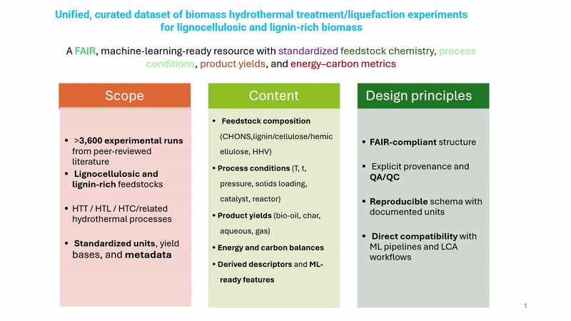

# Biomass HTT/HTL Dataset

## Overview

Comprehensive dataset of hydrothermal treatment and liquefaction experiments for lignocellulosic and lignin-rich biomass. Contains **3,693 experimental runs** from peer-reviewed literature (1982-2026).

**Key features:**
- HTL, HTC, and solvothermal conversion processes
- 145 features: feedstock composition, process conditions, product yields, energy recovery
- Comprehensive quality controls and provenance tracking
- Machine learning-ready format

## Quick Start

```python
import pandas as pd

df = pd.read_csv("master_dataset.csv")
print(f"{len(df)} experiments | {len(df.columns)} columns")
print(f"Years: {df['year'].min()}-{df['year'].max()}")
```

## Dataset Structure

```
master_dataset.csv      Main dataset (3,693 rows × 145 columns)
metadata/               Metadata files
  ├── metadata.json     Schema and completeness stats
  ├── metadata.xml      XML format
  ├── metadata_radar.xml RADAR repository format
  ├── column_metadata.csv Column documentation
  ├── technical_metadata.txt Technical specifications
  ├── ABSTRACT.txt      Dataset abstract
  ├── RADAR_DESCRIPTION.txt Repository description
  └── generate_metadata.py Metadata generator
modules/                Analysis utilities
notebooks/              Example notebooks
LICENSE                 CC BY 4.0
CITATION.cff           Citation metadata
METHODOLOGY.txt         Detailed methodology for research papers
```

## Data Organization

### Process Conditions
- Temperature: 200-400°C (typical)
- Time: residence + ramp times
- Reactor type, atmosphere, solvent
- Catalyst loading, biomass concentration
- Pressure (autogenous or specified)

### Feedstock Characterization
- Ultimate analysis: C, H, O, N, S, Ash (wt%)
- Structural composition: Lignin, Cellulose, Hemicellulose (wt%)
- Heating value (HHV)
- Van Krevelen ratios (O/C, H/C)
- Lignin Readiness Index (LRI)

### Product Properties
- Yields: bio-oil, char, gas, aqueous (wt%)
- Energy recovery (%)
- Carbon recovery (%)
- Product composition and heating values

### Quality Assurance
- Provenance tracking for all data points
- Imputation flags and methods
- Mass balance checks
- Completeness indicators

## Units

| Property | Unit | Basis |
|----------|------|-------|
| Temperature | °C | - |
| Time | min | - |
| Pressure | MPa | - |
| Composition | wt% | dry or daf |
| Yields | wt% | dry feedstock |
| Energy | MJ/kg | dry basis |
| Ratios | - | molar |

## Data Quality

**Completeness** (selected features):
- Core features (C, O, T, time): >98%
- Lignocellulosic composition: ~96%
- Product yields: 70-80%
- Product composition: 20-40%

**Imputation methods:**
- Random Forest models for structural components
- Channiwala-Parikh correlation for HHV
- Family-specific median values
- All imputations flagged and documented

## Usage Examples

### Filter HTL experiments

```python
htl = df[df['process_subtype'].str.contains('HTL', na=False)]
high_temp = htl[htl['T_reaction_C'] >= 350]
```

### Analyze by feedstock family

```python
by_family = df.groupby('Family_std').agg({
    'Yield_biooil_wt_pct': 'mean',
    'Energy_yield_biooil_pct': 'mean'
})
```

### Check data completeness

```python
completeness = df.notna().sum() / len(df) * 100
print(completeness.sort_values(ascending=False).head(10))
```

## Notebooks and Data Ingestion

The `notebooks/` folder includes example notebooks for data exploration. For each source publication, detailed ingestion notebooks were prepared that document the extraction process, perform advanced sanity checks, and reproduce key figures from the original papers. These notebooks include QA-envelope plots (range validation against literature-reported bounds for each process type) to ensure data consistency. Due to copyright restrictions, we cannot share all ingestion notebooks here as they contain reproduced figures, nor the PDFs of publications under restrictive licenses (CC BY-NC-ND or similar). However, the complete ingestion notebooks and source materials are available upon request for academic purposes.

## License

**CC BY 4.0** (Creative Commons Attribution 4.0 International)

You may share and adapt this dataset with appropriate attribution.

## Citation

```bibtex
@dataset{elfetni2026biomass,
  author    = {El Fetni, Seifallah},
  title     = {Biomass HTT/HTL Dataset},
  year      = {2026},
  publisher = {RADAR},
  version   = {1.0.0},
  doi       = {10.22000/XXXXX}
}
```

## Contact

**Seifallah El Fetni**  
CTC gGmbH  
ORCID: [0000-0003-3615-627X](https://orcid.org/0000-0003-3615-627X)

For issues or contributions, please open an issue or contact directly.

## Acknowledgments

Data compiled from peer-reviewed literature. Thanks to all original authors for their research contributions.

**Tools used:**
- Python (pandas, scikit-learn)
- Custom QA pipelines
- Van Krevelen diagram validation
- Mass and energy balance checks


## Database Overview

